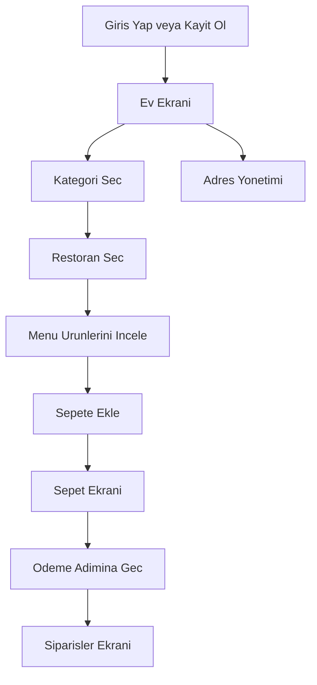

## 1. Urun Genel Bakisi
Cabuk Musteri Uygulamasi, Istanbul'daki kullanicilarin Turkce arayuz ile restoran kesfetmesini, sepet olusturmasini ve siparislerini yonetmesini saglayan mobil teslimat uygulamasidir.
- Hedef kullanici kitlesi: Istanbul icinde hizli yemek, market ve eczane siparisi vermek isteyen son kullanicilar
- Pazar degeri: Yerel Turk mutfagi odakli deneyimi, adres bicimi uyumu ve Stripe Turkiye odeme akisiyla farklilasir

## 2. Temel Ozellikler

### 2.1 Kullanici Rolleri
| Rol | Kayit Yontemi | Temel Yetkiler |
|-----|---------------|----------------|
| Musteri | E-posta ile kayit | Giris yapma, restoran listeleme, menu inceleme, sepete urun ekleme, siparisleri gorme, adres yonetme |

### 2.2 Ozellik Modulleri
1. **Giris ekrani**: e-posta ve sifre ile oturum acma
2. **Kayit ekrani**: ad soyad, e-posta, sifre ve telefon ile hesap olusturma
3. **Ana sayfa**: kategori filtreleme ve Turk restoran kartlari listesi
4. **Restoran ekrani**: Turkce menu urunlerini gosterme ve sepete ekleme
5. **Sepet ekrani**: secilen urunleri gosterme, toplam tutar hesaplama ve odeme aksiyonu
6. **Siparisler ekrani**: gecmis siparisleri ve Turkce durum rozetlerini gosterme
7. **Adres yonetimi ekrani**: Mahalle, Sokak, Apartman, Kat, Daire, Posta Kodu formatina uygun adres saklama

### 2.3 Sayfa Detaylari
| Sayfa Adi | Modul Adi | Ozellik Aciklamasi |
|-----------|-----------|--------------------|
| Giris Yap | Giris formu | E-posta ve sifre alanlari, "Giris Yap" butonu, kayit ekranina yonlendirme |
| Kayit Ol | Kayit formu | Ad soyad, e-posta, sifre, telefon alanlari, "Kayit Ol" butonu |
| Ev | Kategori filtre cubugu | "Tumu", "Restoranlar", "Kahvalti", "Pide & Simit", "Kunefe & Tatlilar", "Market", "Eczane" filtreleri |
| Ev | Restoran kartlari | Gorsel, Turkce restoran adi, puan, teslimat suresi, "Menuye Git" butonu |
| Restoran | Menu listesi | Simit, Pide - Kasarli, Kunefe, Cig Kofte gibi urunler ve "Sepete Ekle" butonu |
| Sepet | Sepet ozeti | Secilen urunler, adet, toplam tutar, "Ode" butonu |
| Siparisler | Siparis gecmisi | Siparis listesi, durum rozetleri: Hazirlaniyor, Yolda, Teslim Edildi, Iptal Edildi |
| Adres Yonetimi | Adres formu | Mahalle, Sokak, Apartman, Kat, Daire, Posta Kodu alanlari ve kaydet aksiyonu |

## 3. Temel Akis
Kullanici once giris yapar veya kayit olur. Ardindan ana sayfada kategori secip restoranlari listeler. Bir restorana girerek urunleri sepete ekler, sepet ekraninda toplam tutari gorur ve odeme adimina ilerler. Son olarak siparis durumlarini ve kayitli adreslerini Turkce arayuz uzerinden yonetir.

## 4. Kullanici Arayuzu Tasarimi
### 4.1 Tasarim Stili
- Ana renk: Yesil `#4CAF50`
- Ikincil vurgu rengi: Turuncu `#FF9800`
- Buton stili: Tam genislikte, yumusak koseli, minimum `50px` yukseklik, belirgin kontrast
- Yazi tipleri: Sistem tabanli okunakli sans-serif, basliklarda yari kalin, govdede duzenli
- Yerlesim stili: Mobil odakli kart tabanli liste, alt sekme gezintisi, ustte arama ve filtre alani
- Ikon stili: Sade cizgi ikonlar, durum rozetlerinde dolgu arka plan

### 4.2 Sayfa Tasarim Ozeti
| Sayfa Adi | Modul Adi | UI Ogelari |
|-----------|-----------|------------|
| Giris Yap | Form alani | Beyaz kart, yesil birincil buton, turuncu link vurgu, genis input alanlari |
| Kayit Ol | Form alani | Adim hissi veren baslik, telefon girisi, tutarli bosluklar |
| Ev | Kategori cubugu | Yatay kaydirilabilir chip yapisi, secili filtrede yesil dolgu |
| Ev | Restoran kartlari | Buyuk gorsel, puan rozeti, teslimat suresi etiketi, turuncu ikincil aksiyon |
| Restoran | Menu urun kartlari | Fiyatin `₺` ile vurgulanmasi, sabit alt aksiyon veya satir ici buton |
| Sepet | Ozet paneli | Ara toplam, toplam, odeme butonu, urun satirlari icin net ayirim |
| Siparisler | Durum listesi | Renkli durum rozetleri, siparis ozeti, zaman bilgisi |
| Adres Yonetimi | Adres formu | Mahalle, Sokak, Apartman, Kat, Daire, Posta Kodu icin dikey duzen |

### 4.3 Duyarlilik
- Mobil once tasarlanir ve Expo uzerinde iOS/Android uyumlulugu hedeflenir
- Dokunmatik hedefler minimum 44px yerine bu projede en az 50px olacak sekilde buyutulur
- Kucuk ekranlarda yatay kategori listesi kaydirilabilir, kartlar tek sutunlu yapida kalir
