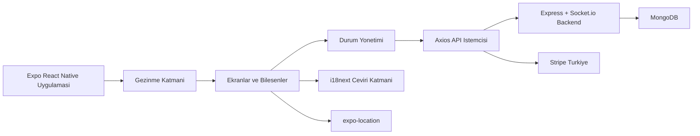
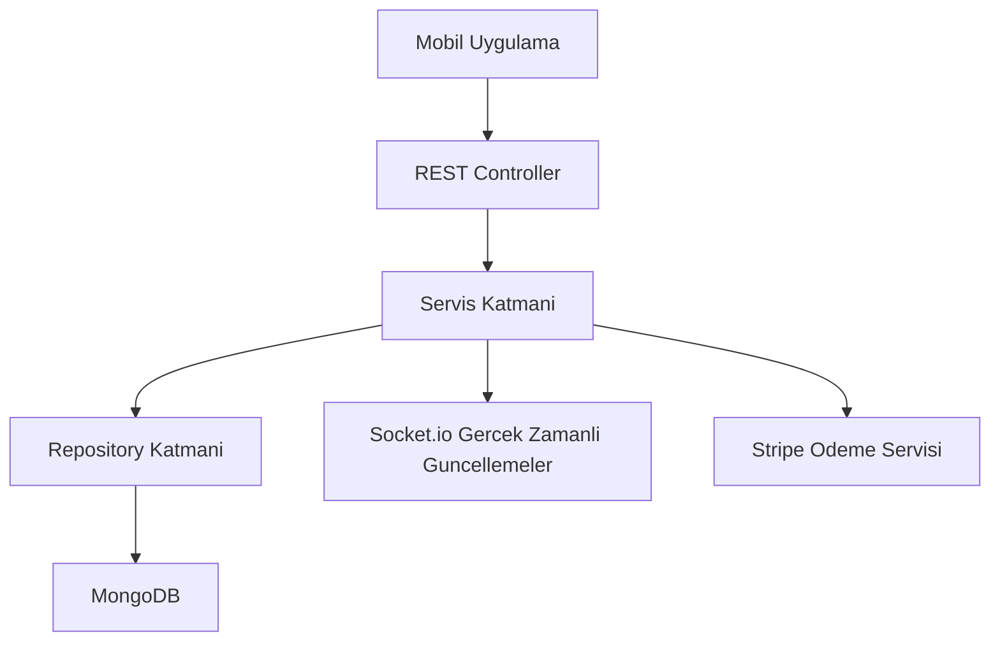
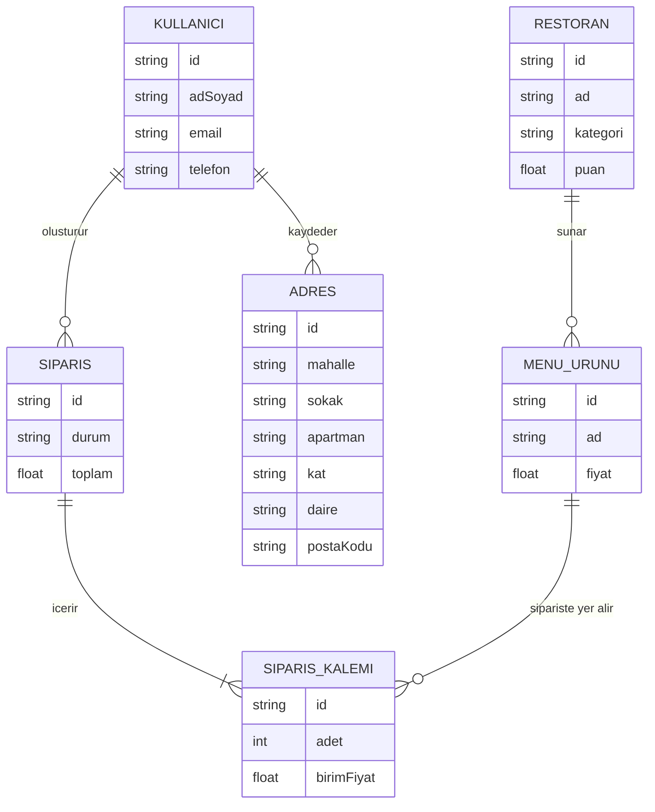

## 1. Mimari Tasarim


## 2. Teknoloji Aciklamasi
- Mobil uygulama: React Native + Expo + TypeScript
- Gezinme: `@react-navigation/native`, alt sekmeler ve stack navigasyonu
- Ag katmani: `axios`
- Konum servisleri: `expo-location`
- Coklu dil altyapisi: `i18next` + `react-i18next`
- Stil sistemi: React Native `StyleSheet` yapisi, tema sabitleri ile renk yonetimi
- Backend entegrasyonu: Node.js + Express + Socket.io + MongoDB
- Odeme entegrasyonu: Stripe Turkiye (kart ve QR kod akisi)

## 3. Rota Tanimlari
| Rota | Amac |
|------|------|
| Login | Kullanici girisi |
| Signup | Yeni hesap olusturma |
| Home | Kategori ve restoran listesi |
| Restaurant | Secili restoranin menu detaylari |
| Cart | Sepet ve toplam tutar |
| Orders | Siparis gecmisi ve durumlari |
| Address | Kayitli adresleri yonetme |

## 4. API Tanimlari
```ts
type GirisIstek = {
  email: string;
  sifre: string;
};

type KayitIstek = {
  adSoyad: string;
  email: string;
  sifre: string;
  telefon: string;
};

type Restoran = {
  id: string;
  ad: string;
  kategori: string;
  puan: number;
  teslimatSuresi: string;
  gorselUrl: string;
};

type MenuUrunu = {
  id: string;
  ad: string;
  fiyat: number;
  aciklama?: string;
};

type SepetKalemi = {
  urunId: string;
  ad: string;
  fiyat: number;
  adet: number;
};

type Adres = {
  mahalle: string;
  sokak: string;
  apartman: string;
  kat: string;
  daire: string;
  postaKodu: string;
};
```

## 5. Sunucu Mimari Diyagrami


## 6. Veri Modeli
### 6.1 Veri Modeli Tanimi


### 6.2 Veri Tanimlama Notlari
- Ilk surum icin istemci tarafinda mock veri ile baslanir
- Siparis durumlari: `Hazirlaniyor`, `Yolda`, `Teslim Edildi`, `Iptal Edildi`
- Para birimi tum hesaplamalarda `TRY` olarak tutulur, arayuzde `₺` ile gosterilir
- Adres modeli Istanbul adres bicimi ile bire bir uyumludur: Mahalle, Sokak, Apartman, Kat, Daire, Posta Kodu
