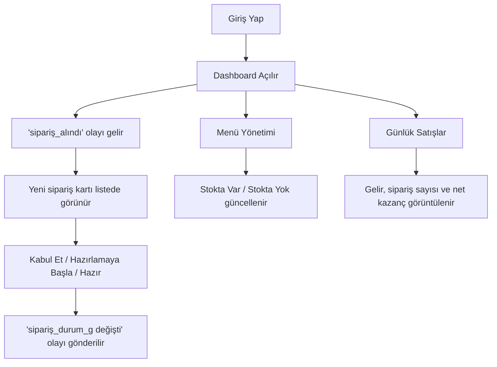

## 1. Ürün Özeti
Cabuk Merchant Dashboard, İstanbul'daki işletmelerin sipariş, menü stoku ve günlük gelirlerini tek panelden gerçek zamanlı takip etmesini sağlayan masaüstü öncelikli bir web uygulamasıdır.
- Hedef kullanıcılar restoran sahipleri ve mağaza operasyon ekipleridir.
- Ürün değeri; sipariş kabul süresini hızlandırmak, stok görünürlüğünü artırmak ve günlük kazancı net şekilde göstermek üzerine kuruludur.

## 2. Temel Özellikler

### 2.1 Kullanıcı Rolü
| Rol | Giriş Yöntemi | Temel Yetkiler |
|------|----------------|----------------|
| İşletme Kullanıcısı | E-posta + şifre | Sipariş yönetimi, menü stoğu güncelleme, finansal özet görüntüleme |

### 2.2 Özellik Modülleri
1. **Giriş Sayfası**: e-posta, şifre, giriş butonu, hata mesajı
2. **Dashboard Sayfası**: `Yeni Siparişler` listesi, sipariş kartları, canlı durum aksiyonları
3. **Menü Yönetimi Sayfası**: Simit, Pide, Künefe, Çiğ Köfte için stok yönetimi
4. **Günlük Satışlar Sayfası**: ciro, sipariş sayısı, `%10` komisyon sonrası net kazanç

### 2.3 Sayfa Detayları
| Sayfa Adı | Modül Adı | Özellik Açıklaması |
|-----------|-----------|--------------------|
| Giriş Yap | Kimlik doğrulama formu | Kullanıcı e-posta ve şifre ile giriş yapar, hata durumunda uyarı görür |
| Dashboard | Yeni Siparişler | Socket.io ile gelen yeni siparişler gerçek zamanlı listelenir |
| Dashboard | OrderCard | Müşteri adı, ürünler, adres ve toplam tutar `₺` ile gösterilir |
| Dashboard | Durum butonları | `Kabul Et`, `Hazırlamaya Başla`, `Hazır` butonları ile sipariş güncellenir |
| Menü Yönetimi | Ürün listesi | Simit, Pide, Künefe, Çiğ Köfte kart veya tablo olarak gösterilir |
| Menü Yönetimi | Stok kontrolü | `Stokta Var` / `Stokta Yok` anahtarı ile ürün erişilebilirliği güncellenir |
| Günlük Satışlar | Finans kartları | Günlük gelir, sipariş sayısı ve net kazanç tek bakışta sunulur |
| Günlük Satışlar | Komisyon hesabı | Toplam gelirden `%10` komisyon düşülerek net kazanç hesaplanır |

## 3. Temel Akış
İşletme kullanıcısı giriş yapar, dashboard ekranında canlı siparişleri görür, siparişi kabul eder ve hazırlık durumlarını günceller. Aynı panelden menü stoklarını açıp kapatır, ardından günlük satış ekranında gelir ve net kazancı takip eder.

## 4. Kullanıcı Arayüzü Tasarımı
### 4.1 Tasarım Stili
- Ana renkler: koyu zemin, sıcak turuncu vurgu, başarı için yeşil, uyarı için amber
- Buton stili: büyük köşeli, belirgin dolgu ve gölge, hızlı durum aksiyonlarına uygun
- Yazı tipi: güçlü başlık fontu + okunaklı yönetim paneli gövde fontu
- Yerleşim: masaüstü öncelikli, sol menü + üst özet alanı + kart bazlı içerik
- İkon stili: sade yönetim paneli ikonları, sipariş ve finans için net durum işaretleri

### 4.2 Sayfa Tasarım Özeti
| Sayfa Adı | Modül Adı | Arayüz Öğeleri |
|-----------|-----------|----------------|
| Giriş Yap | Form alanı | yüksek kontrast kart, e-posta ve şifre girişleri, güçlü CTA |
| Dashboard | Sipariş kartları | canlı liste, renkli durum etiketleri, aksiyon butonları |
| Menü Yönetimi | Ürün kartları | ürün adı, stok etiketi, anahtar kontrolü, hızlı görsel tarama |
| Günlük Satışlar | KPI kartları | büyük `₺` değerleri, sipariş sayacı, net kazanç özeti |

### 4.3 Duyarlılık
Masaüstü öncelikli tasarım kullanılacaktır. Tablet uyarlaması desteklenecek, dar ekranlarda kartlar tek kolona düşecek ve aksiyon butonları dikey hizalanacaktır.
