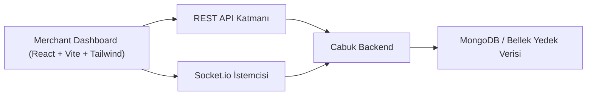
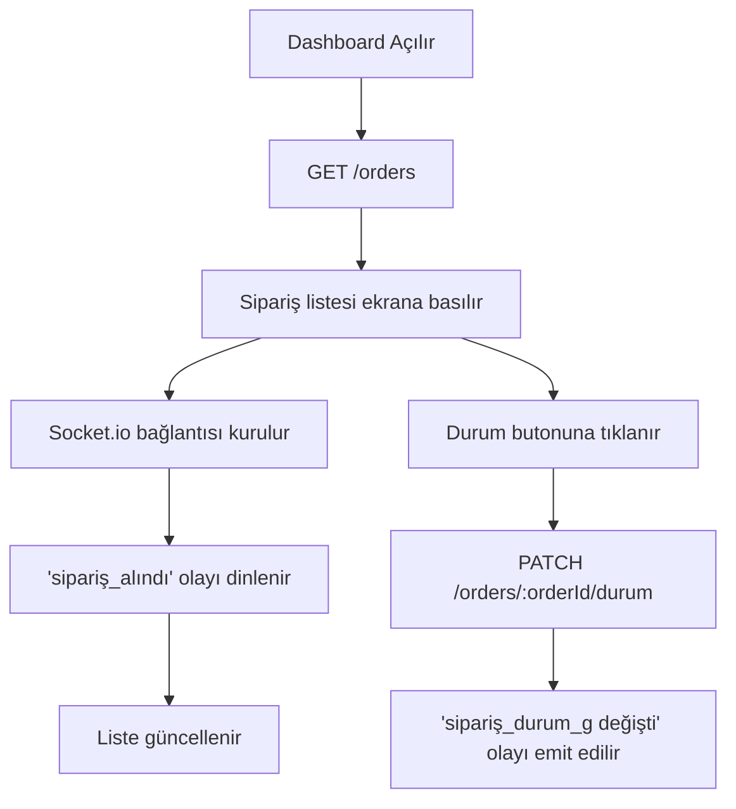
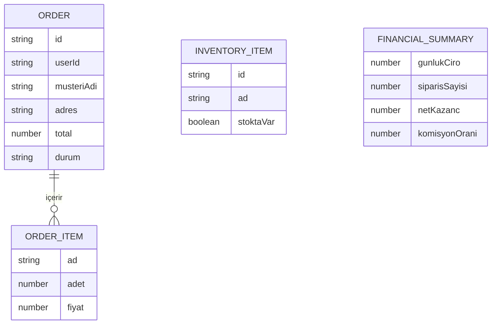

## 1. Mimari Tasarım


## 2. Teknoloji Tanımı
- Ön Yüz: `React` + `Vite` + `Tailwind CSS`
- Başlatma Aracı: mevcut `merchant-dashboard` Vite projesi
- Gerçek Zamanlı Katman: `socket.io-client`
- Durum Yönetimi: React state + hafif yardımcı hook yapısı
- Arayüz Yaklaşımı: masaüstü öncelikli yönetim paneli
- Veri Kaynağı: Cabuk backend REST uçları + Socket.io olayları

## 3. Rota Tanımları
| Rota | Amaç |
|------|------|
| `/` | Giriş ekranını gösterir |
| `/dashboard` | `Yeni Siparişler` canlı sipariş ekranını gösterir |
| `/inventory` | `Menü Yönetimi` ekranını gösterir |
| `/finansal` | `Günlük Satışlar` ekranını gösterir |

## 4. API Tanımları
```ts
type MerchantOrder = {
  id: string;
  userId: string;
  musteriAdi: string;
  items: { ad: string; adet: number; fiyat: number }[];
  adres: string;
  total: number;
  durum: 'sipariş_alındı' | 'hazırlanıyor' | 'alındı' | 'yaklaşıyor' | 'kapıda';
};

type InventoryItem = {
  id: string;
  ad: 'Simit' | 'Pide' | 'Künefe' | 'Çiğ Köfte';
  stoktaVar: boolean;
};

type FinancialSummary = {
  gunlukCiro: number;
  siparisSayisi: number;
  netKazanc: number;
  komisyonOrani: number;
};
```

Önerilen istekler:
- `POST /auth/login`
- `GET /orders`
- `PATCH /orders/:orderId/durum`
- `GET /inventory`
- `PATCH /inventory/:itemId`
- `GET /financial/daily`

## 5. Sunucu Etkileşim Diyagramı


## 6. Veri Modeli
### 6.1 Veri Modeli Tanımı


### 6.2 Ön Yüz Veri Kuralları
- Sipariş listesi ilk yüklemede REST ile alınır, canlı değişimler Socket.io ile yansıtılır.
- İşletme sipariş durumu güncellediğinde hem yerel arayüz state'i hem de backend senkronu güncellenir.
- `netKazanc` değeri `gunlukCiro * 0.9` formülü ile veya backend cevabından hesaplanır.
- Stok durumu anahtar bileşeni ile değiştirilir ve ürün kartında anında görsel geri bildirim verilir.
